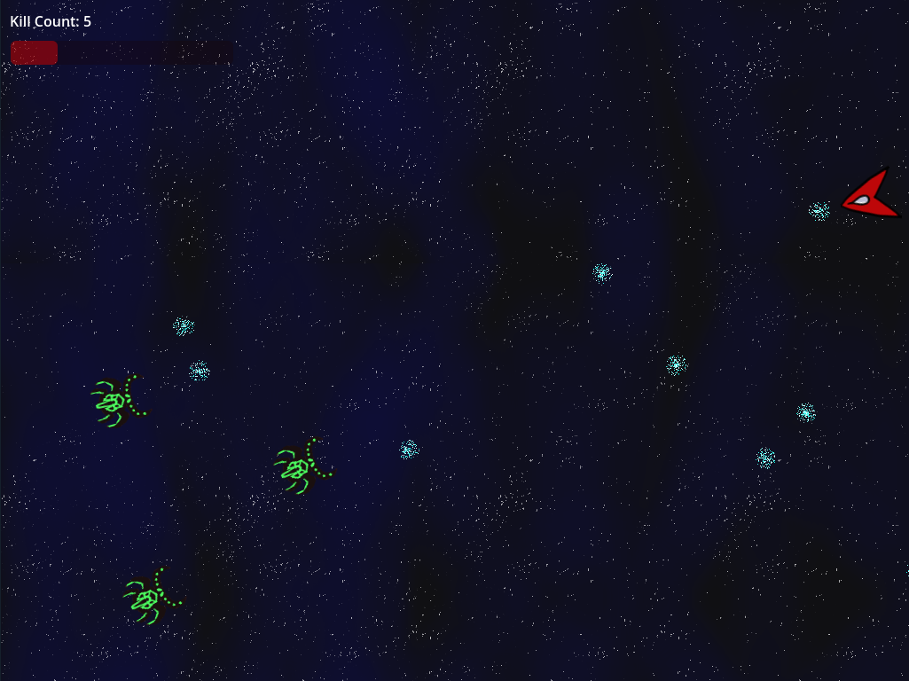

<!DOCTYPE html>
<html>
<h1>Soul Salvage</h1>

A game-jam game made for Godot Wild Jam #71

<table>
	<tr>
		<td>
					
		</td>      
		<td>
			</td>
		<td>
			
		</td>
	</tr>
</table>

<h3>Summary</h3>

&emsp;Soul Salvage is a top-down space-shooter where the player must defeat a certain number of enemies to win. But if they take too much damage, they are sent to the afterlife and must fight to regain their missing health. Enemies in the afterlife that succeed in reducing the player's health again will take away from the kill count, being "revived".

<h3>Download Info</h3>

&emsp;I recommend <a href="https://glitchdstudios.itch.io/soul-salvage">going to the itch.io page<a>, where the builds can be downloaded individually for your operating system. I have included the Linux and Windows builds in this repo, just in case. But the MacOS version was just too large for free Github, even when compressed.

<h3>Gameplay Controls</h3>
<table>
	<tr>
    	<th>Action</th>
        <th>Mouse/Keyboard</th>
        <th>Controller</th>
    </tr>
    <tr>
    	<td>Move</td>
        <td>WASD</td>
        <td>Left Thumbstick</td>
    </tr>
    <tr>
    	<td>Aim</td>
        <td>Mouse Cursor</td>
        <td>Right Thumbstick</td>
    </tr>
    <tr>
    	<td>Shoot</td>
        <td>Left Mouse Button</td>
        <td>Right Trigger</td>
    </tr>
    <tr>
    	<td>Pause</td>
        <td>ESC</td>
        <td>Start/Options Button</td>
    </tr>
</table>

<h3>Development Notes</h3>
<h4><i>About the Jam</i></h4>

&emsp;The major theme of Godot Wild Jam #71 was "Unintended Consequences". Alongside this, my jam partner and I chose one of the optional themes, “Not Dead Yet”; to have the game over screen be a mini game. We had 9 days total to design, develop, test, and publish our game.

<h4><i>Game Design Overview</i></h4>

&emsp;After brainstorming for a few hours we narrowed our potential ideas to a top-down style space shooter. The player would attempt to defeat a certain number of enemies while avoiding enemy projectiles. A very simple concept and easy to implement with our limited time budget. But we added the twist that when the player ran out of health, instead of just getting a game over, the player would be shifted to what I called the Afterlife. Their priorities remain mostly the same there; shoot enemies, avoid projectiles. However, they are then attempting to regain their missing health. If an enemy successfully lands a shot on the player and reduces their health past zero again, then the player’s kill counter starts to be reduced. We frame this as the enemy being revived from the Afterlife, an unintended consequence of the players performance. The it also means that the player can quickly test strategies and gain experience to improve.

<h4><i>Programming and Development - My Contributions</i></h4>

&emsp;I began the jam by working on the artwork. The player ship design and the space bugs were not meant to be very complicated. Their base shapes are actually the result of me doodling while we were nearing the end of the design phase. As for the backgrounds, we knew we thought it obvious to include one with a space design for our space shooter. Figuring out what to do for an afterlife background was a little more challenging. I eventually suggested a heavenly approach with clouds that seemed to be glowing. They both also needed to be seamless at the edges for the scrolling effect to work. A way to transition between the two was also needed, so I created a brush that let me strip pieces of the images away. With the space themed background being layered on top, I only needed to apply this effect to it so that it would reveal or hide the Afterlife image below it. 
&emsp;Not only did I make the art but I also implemented the code for it as well. The detection for the transition to and from the Afterlife, the gameplay pause, and the synchronized transition of background and gameplay elements were my handiwork. At one point, I realized we had made the enemies and projectiles spawn and despawn new entities every time they were needed/not needed. So, I also did some refactoring on their structures so that they were pulling from pools instead. Better for performance, and good development practice, but I also know that it wouldn’t necessarily matter on a game this small.

</html>
